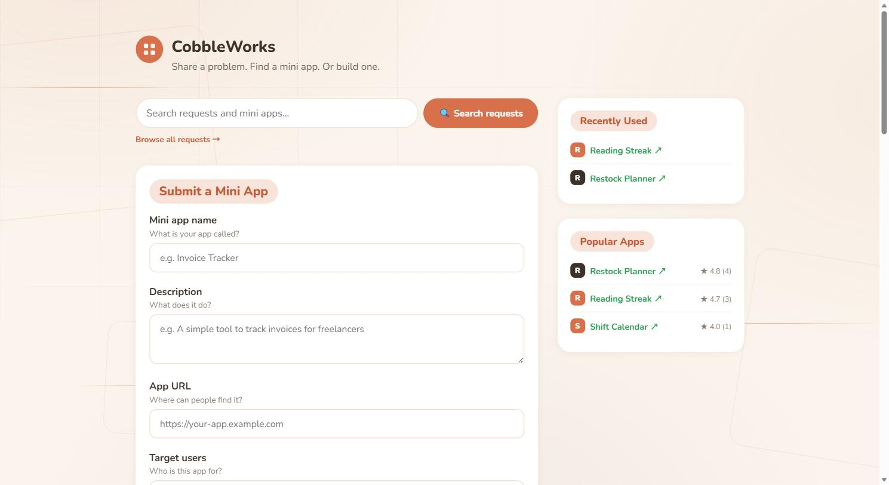
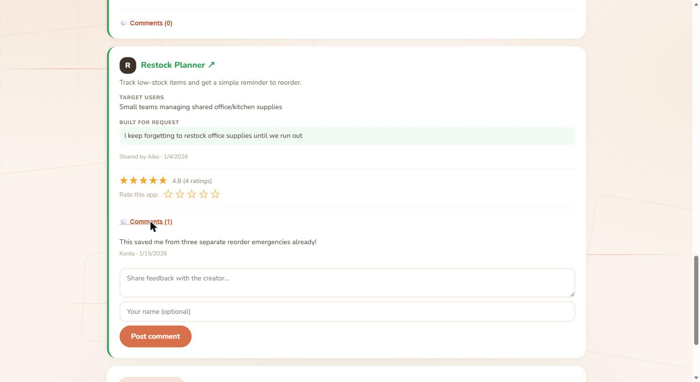

# CobbleWorks

Share a problem. Find a mini app. Or build one.

**Live site:** https://8w4jgy4rp5-commits.github.io/App-Sharing-/

## What is this?

CobbleWorks is a small, no-backend platform built around one idea: **Problem → Request → Mini App**.

- Anyone can post a request describing a small problem they run into ("I keep forgetting to restock supplies," "I want to track my reading streak").
- Anyone can build a tiny, focused app that answers a request (or just answers a problem they noticed themselves) and share it on the platform.
- Visitors can browse requests and mini apps, rate apps with a star rating, leave comments as feedback for the creator, and see recently used / popular apps.

There's no server and no sign-up — every mini app stores its data only in the visitor's own browser (`localStorage`).

## Mini Apps

The `apps/` folder currently holds 20+ independent mini apps, each answering a specific everyday request — things like a restock planner, a shift calendar, a reading streak tracker, a QR code generator, and a unit converter. Every app is self-contained (its own `index.html` / `style.css` / `script.js`) and works fully offline once loaded.

Each app also gets a star rating and a comments thread, so anyone can leave feedback for its creator:

## Tech

- Plain HTML, CSS, and JavaScript — no framework, no build step, no dependencies.
- No backend — all data lives in `localStorage` in the visitor's browser.
- Shared design tokens (`tokens.css`) keep the platform and every mini app visually consistent.

## Following along

This project is being built in public. Progress updates and build notes are posted (irregularly) on Zenn: https://zenn.dev/cobbler_dev/scraps/6245016230edeb
